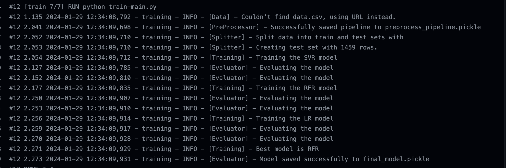

This is a simple project that does a few things in one repo.
It should be noted that the important part of this project is to show end-to-end MLOps pipeline. 
Therefore, the models are not optimized and the data is not super complicated.

The main focus is to get the whole pipeline working.

## ML module
This is the module that contains the ML code. 
The code is built in a way to be robust to different models, scoring functions etc. and I tried to make sure
it's production grade.

- Get data from locally OR (if not found locally, then) from a URL.
  - The data is about house prices.
  - It has 12 features and 1 target with the name "SalePrice".
- Preprocess the data and train 3 simple models.
  - Preprocessing includes:
    - Imputing missing values
    - Encoding categorical features using One Hot Encoding.
  - Models used:
    - Linear Regression
    - Support Vector Regressor
    - Random Forest Regressor
- Compare the models using a scoring function.
  - Default is RMSE but it can be configured to use other scoring functions.
- Choose the best model according to a predefined criteria and save the best model as
a pickle file.
  - The preprocessing pipeline should also be saved to be able to use in production the same way it was fit on the training data.

There are basic unittests for the ML module to make sure it's working as expected.
If in the future, there would be more models, more optimizations or different scoring functions
etc. then the unittests would make sure that the code is still working as expected.



## APP module
This is the module that contains the Flask app.
The chosen model is served using Flask and the app is dockerized.
The app a "/predict" endpoint that accepts a POST request.
The request should have a JSON body with the data to be predicted.


## Containerization
The app is dockerized.
I used Docker multi-stage to first train all models and then use the best model to serve the app.

Tested locally of course:
``` shell
docker build . -t test_app
docker run -p 5000:5000 test_app
```


```
curl -d '[{"MSSubClass": 60,
>     "MSZoning": "RL",
>     "LotArea": 9627,
>     "LotConfig": "Inside",
>     "BldgType": "1Fam",
>     "OverallCond": 5,
>     "YearBuilt": 1993,
>     "YearRemodAdd": 1994,
>     "Exterior1st": "HdBoard",
>     "BsmtFinSF2": 0.0,
>     "TotalBsmtSF": 996.0}]' -H "Content-Type: application/json" -X POST http://0.0.0.0:5000/predict
```


## CI/CD
The CI/CD is done using Github Actions.
There a few different workflows:
1) Unit tests - Runs the unittests for the ML module on each push to the repo.
2) Deploy to ECR - On each change to the main branch, the app is built and pushed to ECR with a new tag. (after making sure the unittests are passing)
3) Deploy to Docker Hub - On each change to the main branch, the app is built and pushed to Docker Hub. 
This is actually not needed but I used to play around with the image etc. and testing.
4) Deploy EC2 machines on Amazon - I used Terraform to deploy EC2 machines on AWS. (after pushing the image to ECR)
   (The Terraform code of the ECR repo creation is not included in this repo as I already ran it and not required for the CI/CD)
5) Deploy the app to EC2 - I used Terraform to deploy the app to EC2 machine.
NOTE: This is not best practice! I just did it so that I could get the app working on an EC2 machine and test it.
In a real world scenario, I would use ECS (Fargate or EC2) or more probably EKS (with K8s) to deploy the app in a more structured and scalable way.
This is also a better idea as I'm already in the AWS ecosystem and it would be easier to manage.
Obviously, I would also use a load balancer and/or auto-scaling (assuming a cluster of EC2 machines would be needed with more resources for a real world scenario ) 
etc. to make it more scalable and robust for production.

NOTE: There are security risks in that the EC2 machine is open to the world and the app is running as root. 
It could be mitigated by stricter security groups.

## Proof!


Notice that the EC2 machine is running with the instance_id "i-0f2b6b2b2b2b2b2b2" and outputting us the public IP address.
This way we can do another POST request to the app's predict endpoint and get the prediction!

## Next Steps
I will separate it into 2 parts:
1) If I had more time
2) Longer term/more complete end-to-end solution

### If I had more time
- Add more unittests for the ML module.
- Multiple environments for production and staging etc. with different workflows and configurations. 
This way I could separate my testing environment from the actual production environment.
- Separate to 2 repos:
  - One repo for serving and deploying the app & another repo for actual ML work.
  - This way, we could separate the ML research, different use cases and improvements for the models and/or parts of
  the pipeline from the actual serving and deployment. 
  The serving and deployment should be agnostic to the model being used.
  - In the given structure, a small bug with the data used or other ML/logic related bugs would be caught only when deployed
    (even though there are unittests for the ML module).

### More complete solution
The goal is to have a robust MLOps pipeline that distributes the work between different domain experts. Meaning, the 
data scientists can focus on the models and research on how to optimize the models and get more accurate predictions.
MLOps engineers can focus on serving and deployment without having to worry about the accuracy of the models or other possible
bugs in the ML code.

- Data Validation
  - The data used for the training is not checked for validity now and it can cause unexpected problems both with the app
  and the accuracy of the models. In order to prevent it, we could add a data validation stage (such as Great Expectations) before even starting the model
  training process.
- Model Registry
  - In the current solution we don't really have a way to keep track of the models that were trained and deployed.
  - We could save each model to a registry and then the serving part would be able to pull the chosen model from the registry.
  - Writing to the registry could be done using a CI/CD pipeline including some necessary checks to make sure the models are as expected.
- Experiment Management
  - Instead of just defining one criteria and choosing the best model, we could keep track of different metrics in different 
  parts of the model training pipeline.
  - This would also allow versioning for training data.
  - In a more complex model training pipeline, we probably would have HPS tuning, different models, different scoring functions etc.
- Periodic/Conditional Retraining
  - Instead of a push to this repo with new data and manually triggering the training and deployment, we could either have a
  periodic retraining (depending on the data) that can periodically check for new data from either the database or file storage and train.
  - Another option is to have a monitoring system on the model that could detect data drift and/or target drift and trigger a retraining.
- Separating the parts of the model training pipeline instead of having one big script.
  - This would allow us to improve different parts of the pipeline without having to change everything else.
  - This would also enable modularity and parallelization.
  - A workflow orchestrator could be used to manage the pipeline.

## Notes
- Ansible could also be used to deploy the app to the EC2 machines. 
I started working on it but didn't have enough time to finish it as I'm not very familiar with Ansible.
I took a few hours to learn it and was actually pretty fun, however, I didn't feel comfortable and confident enough to
use it for this project.

### Methodology
- Terraform would output the public IP address of the EC2 machine.
  - The output can already be configured as the `hosts.cfg` file Ansible needs.
  - This file would be created after terraform creates the EC2 instances ready to use.

```terraform
data "template_file" "hosts_cfg" {
    template = file("./hosts.tpl")
    vars = {
        instance_name = join(" ansible_user=<user> \
                                 ansible_ssh_private_key_file=<ssh_key_path> \
                                 ansible_ssh_common_args='-o \
                                 StrictHostKeyChecking=no'\n ", 
                                 concat(aws_instance.servers.*.public_ip, [""]))
    }
}
 
resource "local_file" "hosts_cfg" {
    content  = data.template_file.hosts.rendered
    filename = "Ansible/hosts.cfg"
}
```

- Ansible would then use this file and a playbook to run the app on the EC2 machine.
  - The playbook would be something like this:

## Final Notes
- I had a lot of fun working on this project and learned a lot of new things!
- I'm looking forward to hearing your feedback and comments!